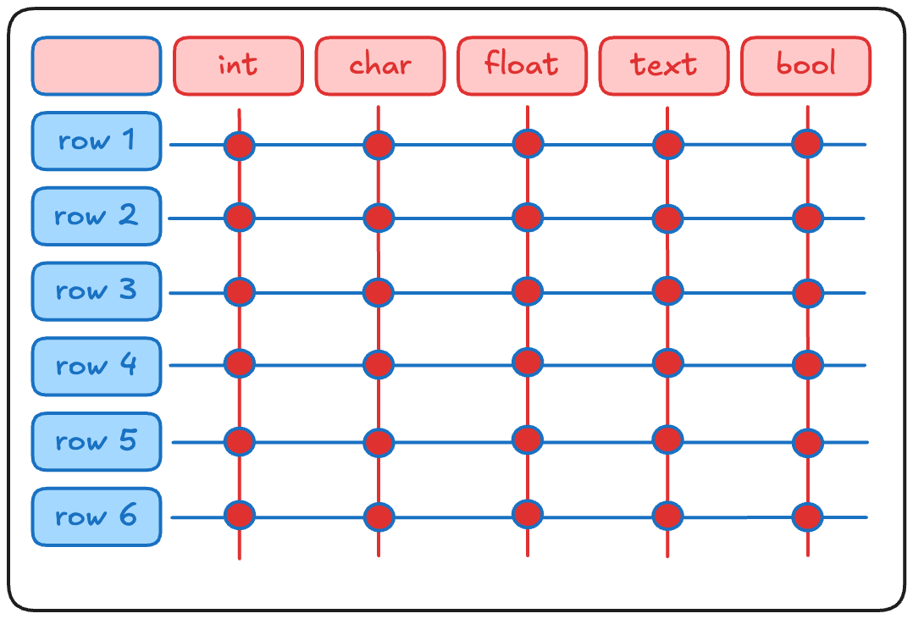
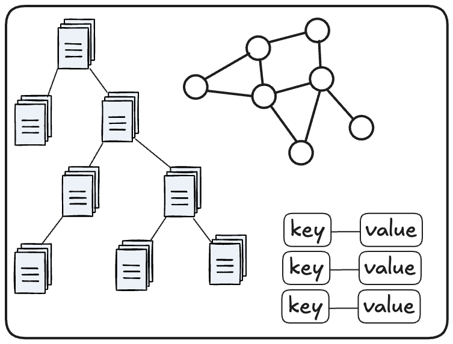
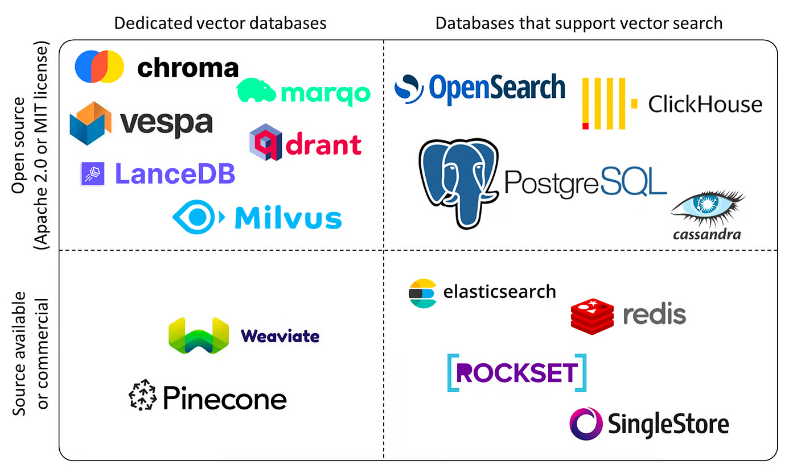

# Vector Databases

Os dados se tornaram cada vez mais importantes para as empresas, e a necessidade de armazenar, pesquisar e analisar esses dados de forma eficiente é crucial e a maneira como lidamos com dados mudou drasticamente nos últimos anos. Com o crescimento exponencial da quantidade de dados gerados, as abordagens tradicionais de bancos de dados relacionais não são mais suficientes para lidar com a complexidade e a escala dos dados modernos. É aí que entram os bancos de dados vetoriais.

## Mas vamos começar do começo

No início, os dados eram simples e estruturados, armazenados em tabelas relacionais. 



No entanto, à medida que a variedade e a complexidade dos dados cresceram, tornou-se evidente que uma nova abordagem era necessária.

O numero de dados não estruturados, como texto, imagens e áudio, aumentou exponencialmente. Esses dados não podem ser facilmente representados em tabelas relacionais, o que levou ao surgimento de bancos de dados NoSQL.


Mas mesmo os bancos de dados NoSQL enfrentam desafios quando se trata de lidar com dados não estruturados e de alta dimensionalidade. É aí que entram os bancos de dados vetoriais, que são projetados para armazenar e pesquisar dados em alta dimensão de forma eficiente.


São os bancos de dados vetoriais que permitem que as empresas aproveitem ao máximo seus dados, permitindo que o uso de LLMs (Modelos de Linguagem) e outras técnicas avançadas de aprendizado de máquina sejam aplicados com muito mais contexto e eficiência.

## O que são bancos de dados vetoriais?

Bancos de dados vetoriais são uma nova classe de bancos de dados projetados para lidar com dados em alta dimensão, como texto, imagens e áudio. Eles armazenam dados como vetores, que são representações numéricas de objetos, permitindo pesquisas eficientes e escaláveis.
Os bancos de dados vetoriais são especialmente úteis para tarefas como busca por similaridade, recomendação de produtos e análise de sentimentos, onde a semântica dos dados é importante.

## Primeiro vamos entender o que é um vetor

Um vetor é uma representação matemática de um objeto em um espaço multidimensional. Em termos simples, um vetor é uma lista de números que representam características ou atributos de um objeto. Por exemplo, um vetor pode representar uma imagem como uma lista de valores de pixels, ou um texto como uma lista de valores que representam palavras.

```
# Exemplo de vetor
vetor = [0.1, 0.5, 0.3, 0.7]
```

## Mas como criamos esses vetores?

Existem várias maneiras de criar vetores a partir de dados não estruturados. Uma abordagem comum é usar técnicas de aprendizado de máquina, como embeddings, que convertem dados em vetores de alta dimensão. Esses embeddings capturam a semântica dos dados, permitindo que objetos semelhantes sejam representados por vetores próximos no espaço multidimensional.

Então vamos pegar um exemplo de como criar vetores a partir de texto usando o modelo OpenAI GPT-3.5:

```python
import openai
openai.api_key = "api-key"
def create_vector(text):
    response = openai.Embedding.create(
        input=text,
        model="text-embedding-ada-002"
    )
    return response['data'][0]['embedding']
text = "Text example for vector creation"
vector = create_vector(text)
print(vector) # [0.1, 0.5, 0.3, 0.7]
```

## E como armazenamos esses vetores?

Agora nós temos os vetores, precisamos armazená-los de forma eficiente para que possamos pesquisá-los rapidamente. É aí que entram os bancos de dados vetoriais.



Nós vamos escolher o Qdrant como nosso banco de dados vetorial.

## O que é o Qdrant?

Qdrant é um banco de dados vetorial de código aberto projetado para armazenar e pesquisar grandes volumes de dados em alta dimensão. Ele é otimizado para consultas de similaridade, permitindo que você encontre rapidamente objetos semelhantes com base em seus vetores.

Qdrant oferece uma API RESTful fácil de usar, suporte a consultas avançadas e integração com várias linguagens de programação, tornando-o uma escolha popular para desenvolvedores que trabalham com dados vetoriais.

## Como instalar o Qdrant?

Para instalar o Qdrant, você pode usar o Docker, que é a maneira mais fácil de executar o Qdrant localmente. Certifique-se de ter o Docker instalado em sua máquina e execute o seguinte comando:

```bash
docker run -p 6333:6333 qdrant/qdrant
```
Isso iniciará o Qdrant em um contêiner Docker, e você poderá acessá-lo na porta 6333.

## Como usar o Qdrant?

Para usar o Qdrant, você pode interagir com ele por meio de sua API RESTful. Aqui está um exemplo básico de como criar uma coleção.

```python
import requests

def create_collection(collection_name):
    url = f"http://localhost:6333/collections/{collection_name}"
    response = requests.put(url)
    if response.status_code == 201:
        print(f"Collection '{collection_name}' created successfully.")
    else:
        print(f"Error creating collection: {response.text}")
collection_name = "vivaworks_example"
create_collection(collection_name) # Collection 'vivaworks_example' created successfully.
```

## Como inserir vetores no Qdrant?
Para inserir vetores no Qdrant, você pode usar a API de inserção. Aqui está um exemplo de como inserir um vetor na coleção que criamos anteriormente.

```python
import requests
import uuid

def insert_vector(collection_name, vector_id, vector):
    url = f"http://localhost:6333/collections/{collection_name}/points"
    data = {
        "points": [
            {
                "id": vector_id,
                "vector": vector
            }
        ]
    }
    response = requests.post(url, json=data)
    if response.status_code == 202:
        print(f"Vector with ID '{vector_id}' inserted successfully.")
    else:
        print(f"Error inserting vector: {response.text}")
collection_name = "vivaworks_example"
vector_id = uuid.uuid4().hex  # Generate a unique ID for the vector
vector = [0.1, 0.5, 0.3, 0.7]  # Vector example
insert_vector(collection_name, vector_id, vector) # Vector with ID '...' inserted successfully.
```

## Como pesquisar vetores no Qdrant?

Para pesquisar vetores no Qdrant, você pode usar a API de busca. Aqui está um exemplo de como pesquisar vetores semelhantes com base em um vetor de consulta.

```python
import requests

def search_vectors(collection_name, query_vector, limit=5):
    url = f"http://localhost:6333/collections/{collection_name}/points/search"
    data = {
        "vector": query_vector,
        "top": limit
    }
    response = requests.post(url, json=data)
    if response.status_code == 200:
        results = response.json()
        print(f"Search results: {results}")
    else:
        print(f"Error searching vectors: {response.text}")
collection_name = "vivaworks_example"
query_vector = [0.1, 0.5, 0.3, 0.7]  # Vector example
search_vectors(collection_name, query_vector) # Search results: {...}
```
Nesse exemplo, estamos pesquisando os vetores semelhantes com base no vetor de consulta fornecido. O Qdrant retornará os vetores mais próximos com base na similaridade. Note que o limite de resultados pode ser ajustado conforme necessário.

## Utilizando o Qdrant com LLMs

Os bancos de dados vetoriais, como o Qdrant, são especialmente úteis quando combinados com LLMs (Modelos de Linguagem de Grande Escala). Eles permitem que você armazene e recupere informações contextuais relevantes para melhorar a precisão e a relevância das respostas geradas pelos modelos.

Por exemplo, você pode armazenar vetores de documentos, perguntas e respostas em um banco de dados vetorial e, em seguida, usar esses vetores para recuperar informações relevantes durante a geração de respostas por um LLM. Isso melhora a capacidade do modelo de fornecer respostas mais precisas e contextualizadas.

Vamos ao codigo de exemplo:

```python
import openai
openai.api_key = "sua-chave-api-aqui"
import requests
import uuid

def create_vector(text):
    response = openai.Embedding.create(
        input=text,
        model="text-embedding-ada-002"
    )
    return response['data'][0]['embedding']
def insert_vector(collection_name, vector_id, vector):
    url = f"http://localhost:6333/collections/{collection_name}/points"
    data = {
        "points": [
            {
                "id": vector_id,
                "vector": vector
            }
        ]
    }
    response = requests.post(url, json=data)
    if response.status_code == 202:
        print(f"Vector with ID '{vector_id}' inserted successfully.")
    else:
        print(f"Error inserting vector: {response.text}")

def search_vectors(collection_name, query_vector, limit=5):
    url = f"http://localhost:6333/collections/{collection_name}/points/search"
    data = {
        "vector": query_vector,
        "top": limit
    }
    response = requests.post(url, json=data)
    if response.status_code == 200:
        results = response.json()
        return results['result']
    else:
        print(f"Error searching vectors: {response.text}")
        return []

def generate_answer(question, context):
    response = openai.ChatCompletion.create(
        model="gpt-3.5-turbo",
        messages=[
            {"role": "system", "content": "You are a helpful assistant."},
            {"role": "user", "content": f"Question: {question}\nContext: {context}"}
        ]
    )
    return response['choices'][0]['message']['content']


collection_name = "vivaworks_example"
vector_id = uuid.uuid4().hex 
text = "This is an example text for vector creation."

vector = create_vector(text)
insert_vector(collection_name, vector_id, vector)
query_vector = create_vector("What is the example text?")
results = search_vectors(collection_name, query_vector)
if results:
    context = " ".join([result['vector'] for result in results])
    answer = generate_answer("What is the example text?", context)
    print(f"Answer: {answer}")
else:
    print("No similar vectors found.")
```

Neste exemplo, estamos criando um vetor a partir de um texto, inserindo-o no Qdrant, pesquisando vetores semelhantes e, em seguida, usando esses vetores para gerar uma resposta a uma pergunta usando o modelo GPT-3.5.

## Mas Luiz, não é só passar sempre o texto para o LLM?

Sim, você pode passar o texto diretamente para o LLM, mas usar um banco de dados vetorial como o Qdrant oferece várias vantagens:
1. **Eficiência**: Em vez de passar todo o texto, você pode passar apenas os vetores relevantes, o que reduz a quantidade de dados processados pelo LLM e melhora a velocidade de resposta.
2. **Contexto**: Os bancos de dados vetoriais permitem que você armazene e recupere informações contextuais relevantes, melhorando a precisão das respostas geradas pelo LLM.
3. **Escalabilidade**: À medida que o volume de dados cresce, os bancos de dados vetoriais permitem consultas eficientes e escaláveis, tornando mais fácil lidar com grandes conjuntos de dados.
4. **Flexibilidade**: Você pode armazenar diferentes tipos de dados (texto, imagens, áudio) como vetores e pesquisá-los de forma eficiente, permitindo uma abordagem mais holística para lidar com dados não estruturados.

## Conclusão
Os bancos de dados vetoriais, como o Qdrant, são uma ferramenta poderosa para lidar com dados não estruturados e de alta dimensionalidade. Eles permitem que você armazene, pesquise e analise dados de forma eficiente, melhorando a capacidade de resposta e a precisão dos modelos de linguagem.
Eles são especialmente úteis quando combinados com LLMs, permitindo que você aproveite ao máximo seus dados e melhore a relevância das respostas geradas pelos modelos.
Espero que este guia tenha sido útil para você entender o que são bancos de dados vetoriais, como criar e armazenar vetores, e como usá-los com LLMs. Se você tiver alguma dúvida ou quiser saber mais sobre o Qdrant ou bancos de dados vetoriais, sinta-se à vontade para perguntar!

## Referências
- [Qdrant Documentation](https://qdrant.tech/documentation/)
- [OpenAI API Documentation](https://platform.openai.com/docs/api-reference)
- [Vector Databases Explained](https://www.pinecone.io/learn/vector-database/)
- [Guia Definitivo para Vector Databases](https://datawaybr.medium.com/guia-definitivo-para-vector-databases-bbeeb8f0d802)
